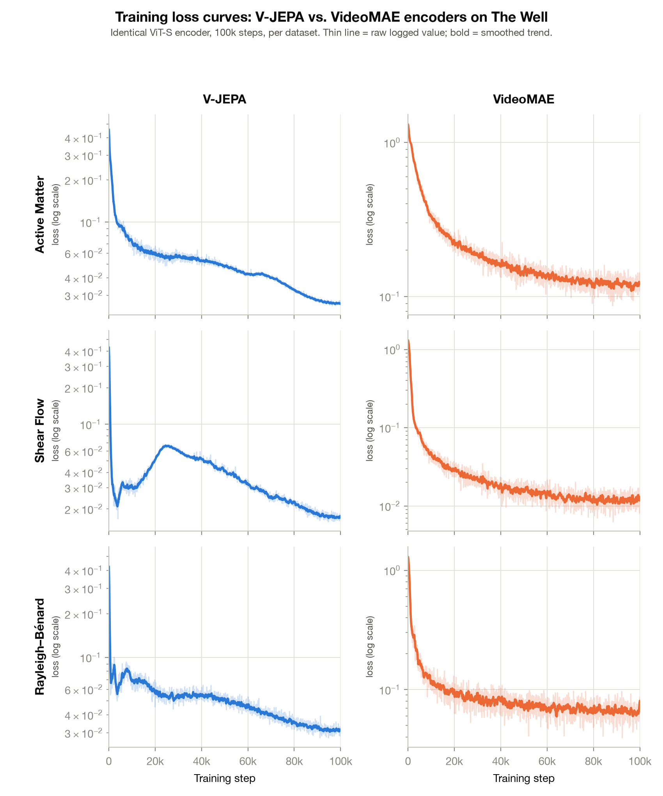

# vJEPA vs vMAE on The Well — research summary

Companion to the top-level [README.md](../README.md), which covers setup and
reproduction. This is the results-facing writeup: what we're testing, how,
and what we've found so far.

## Question

Train two self-supervised video encoders — one with a **latent-prediction**
objective (V-JEPA-style: predict masked patches' *features*), one with a
**pixel-reconstruction** objective (VideoMAE-style: predict masked patches'
*pixels*) — with **identical ViT-S encoders**, on 2D physics simulations from
[The Well](https://polymathic-ai.org/the_well/). Then freeze the encoders and
probe what physics each one's latent space actually encodes. Does predicting
in latent space push the encoder toward representing more/different physical
structure than predicting in pixel space?

## Setup

Three datasets, one JEPA/MAE model pair each (6 runs total): `active_matter`
(11ch, 256×256, active nematics), `shear_flow` (4ch, 256×512, incompressible
NS + tracer), `rayleigh_benard` (4ch, 512×128, buoyancy-driven convection).

| shared | ViT-S encoder (384d × 12 blocks, 6 heads), 2×16×16 tubelet patches, tube masking @ 0.9, T=8 clips at native resolution, per-channel z-score norm, AdamW + cosine, 100k steps, same batch/steps |
|---|---|
| **MAE head** | 4-layer decoder (192d) → MSE on masked patches (`norm_pix`) |
| **JEPA head** | EMA target encoder (0.996→1.0) + 6-layer predictor (384d) → smooth-L1 on layer-normed target features at masked positions |

Full architecture/training detail in [README.md § Design](../README.md#design).

### Training curves

All six runs converge cleanly over the full 100k steps (log-scale y-axis;
note JEPA's smooth-L1-on-latents loss and MAE's pixel-MSE loss are on
different scales and not directly comparable). JEPA's loss on `shear_flow`
and `rayleigh_benard` shows a transient rise-then-recover in the first
~30k steps — worth a caveat/footnote if this figure goes in the paper, since
we haven't dug into whether it's EMA-target warmup or something else.
Reproduce via `scripts/extract_training_history.py` (needs the local
`pod_logs/wandb/` offline-run logs) → `sweep_results/training_history.csv`
→ `scripts/plot_training_curves.py`.

## Two probing pipelines

- **[Linear probe suite](LINEAR_PROBE.md)** — does the *frozen representation*
  linearly encode physics (contemporaneous quantities, trajectory-level
  regime parameters, future content, noise robustness)? No predictor or
  decoder involved — pure ridge regression on frozen features.
- **[Rollout probe suite](ROLLOUT_PROBE.md)** — can the model actually
  *forecast forward*, using its predictor/decoder to generate future
  latents/pixels, single-step and chained autoregressively?

## Headline findings

All numbers below are ridge-probe R² (5-fold CV); "best-layer" means the best
of the 13 checkpoint layers (12 blocks + final norm). Full tables in the two
probe docs; raw numbers in `sweep_results/*.json`.

**1. Contemporaneous physics — JEPA and MAE are close on `active_matter` and
`shear_flow`, but JEPA clearly ahead on `rayleigh_benard`.** Both objectives
decode purely local, near-differential quantities at ceiling on every dataset
(gradients, pressure: R² ≈ 1.0) — a pixel-reconstruction objective directly
rewards keeping exactly this kind of information. Pooled `vorticity_signed`/
`divergence` are dropped as targets (mathematically ≈0 on every clip by
Stokes'/the divergence theorem — not a representational gap, a degenerate
target; still probed at token level). On `rayleigh_benard`, JEPA is well
ahead of MAE specifically on the *coupled* quantities:

| quantity | JEPA best-R² | MAE best-R² |
|---|---|---|
| `velocity_buoyancy_coherence` | 0.583 | −0.049 |
| `convective_flux` | 0.835 | 0.576 |
| `okubo_weiss` | 0.722 | 0.460 |
| `enstrophy` | 0.686 | 0.455 |
| `future_enstrophy` | 0.474 | 0.347 |

**2. Regime parameters (Reynolds/Schmidt, Rayleigh/Prandtl, alpha/zeta) —
roughly matched, MAE slightly ahead in several cases.** Both objectives
decode the constant per-trajectory regime very well (R² 0.77–0.999 at
mid-layers), with shuffled-control R² near 0 confirming no train/val leakage.
This is not where JEPA/MAE differ.

**3. Autoregressive rollout — both objectives degrade similarly, and both
fall behind a naive persistence baseline once errors compound.** Across 8
autoregressive steps, `fed_back` rollout (using the model's own predicted
latents as input for the next step) drops well below the `oracle` baseline
(re-seeded with real context each step) for both objectives, and on
`active_matter`/`rayleigh_benard` it ends up *worse* than simply predicting
"nothing changes" (persistence). JEPA and MAE track each other closely here —
this is not a dimension where JEPA's advantage on `rayleigh_benard` shows up.

**4. Noise robustness — MAE is sharper on clean input, JEPA is more robust to
corruption, and this replicates on held-out data.** At zero injected noise,
MAE's final-layer R² is higher than JEPA's on all three datasets (e.g.
`active_matter` 0.874 vs 0.786, mean across quantities). Under heavy Gaussian
corruption (z-scored std 2.0), MAE collapses on `active_matter` (R² → −1.02)
and degrades sharply on `rayleigh_benard` (0.943 → 0.646, vs JEPA's 0.933 →
0.842); the two are close on `shear_flow` (MAE stays fractionally ahead
throughout — the one dataset with no robustness gap at all). A held-out
`valid`-split check (encoders never pretrained on these trajectories)
reproduces and sharpens this: `active_matter`'s MAE `nematic_order` R² is
−15.4 at *zero* added noise on unseen data. Full detail, including the
token-level noise sweep and the forecast/skill-score results, in
[LINEAR_PROBE.md](LINEAR_PROBE.md).

**5. `rayleigh_benard` is the one dataset where JEPA leads on essentially
every axis** — clean pooled accuracy, depth (needs more layers to reach peak
but reaches a higher one), noise robustness, token-level nonlinear
information MAE simply lacks, and forecast skill at longer horizons. On
`active_matter` and `shear_flow`, clean-data accuracy is a wash or
MAE-favoring. The likely mechanism: `rayleigh_benard`'s buoyancy and
`active_matter`'s active stress both feed back directly into the momentum
equation (two-way coupling), while `shear_flow`'s tracer is passively
advected (one-way) — see [LINEAR_PROBE.md](LINEAR_PROBE.md)'s Discussion
section for the full argument and literature connections.

## Status / caveats

- `reports/*.pdf` and `reports/probing_sweep_report.html` predate the current
  target set and sweep — treat this doc, [LINEAR_PROBE.md](LINEAR_PROBE.md),
  and `sweep_results/*.json` as the current source of truth, not the PDFs.
- LR values (JEPA 1e-4, MAE 5e-5) are the result of a completed LR sweep on
  `active_matter` (see `scripts/gen_configs.py` comment), not placeholders.
- **Probing-suite expansion: complete.** Physics targets re-derived from each
  dataset's governing PDE, token-level probing extended to every probe
  (contemporaneous, regime, rollout, forecast), per-token MLP added, noise
  robustness sweeps all 13 layers (pooled and token) instead of just the
  final one, persistence-relative skill scoring added to the forecast and
  rollout probes, and a held-out `valid`-split generalization check run
  against all three datasets. Full detail and current numbers in
  [LINEAR_PROBE.md](LINEAR_PROBE.md) (contemporaneous/depth/noise/forecast/
  generalization) and [ROLLOUT_PROBE.md](ROLLOUT_PROBE.md) (multi-step
  rollout — still a pre-expansion snapshot, see that doc's own caveat).
- **Held-out test-split evaluation: complete for the three headline
  analyses.** The `valid`-split check above still picks its best layer via
  CV within that same split; `scripts/test_split_eval.py` fixes the
  remaining gap by freezing the layer choice from train-CV *before* touching
  any test data, then fitting once on train and evaluating once on `test`
  trajectories (10/28/50 for active_matter/shear_flow/rayleigh_benard).
  Every headline claim reproduces: `rayleigh_benard`'s JEPA-ahead-on-coupled-
  quantities gap *widens* on test rather than shrinking, `active_matter`'s
  MAE noise-collapse reproduces almost exactly (−0.78 at σ=2 vs. −1.02 on
  train), and `shear_flow` confirms no robustness gap on held-out data
  either. Full numbers and the one regime-coverage pitfall hit and fixed
  along the way: [LINEAR_PROBE.md](LINEAR_PROBE.md#held-out-test-split-evaluation-freezing-layer-selection).
- **No held-out validation loss during pretraining, partially mitigated.**
  `src/train.py` only ever trains on `split="train"` — the training-curve
  figure above is training loss only, for all 6 runs, so the 100k-step budget
  can't be directly justified against a held-out objective-loss curve.
  Intermediate 25/50/75% checkpoints were also deleted in the repo cleanup,
  so probe performance can't be reconstructed at earlier steps. What *is* now
  covered: a held-out `valid`-split check (small slice, 4–5 trajectories per
  dataset — not a full re-validation) reruns the pooled/token/noise-
  robustness probes against data the encoders never pretrained on at all; see
  [LINEAR_PROBE.md](LINEAR_PROBE.md#held-out-generalization-check-valid-split).
  The noise-robustness finding replicates (and sharpens) there, which is
  reassuring but doesn't by itself rule out the pretraining schedule running
  past a generalization optimum — that would need an actual val-loss eval
  loop and retained milestone checkpoints, still not implemented. Revisit if
  a reviewer pushes on this.
